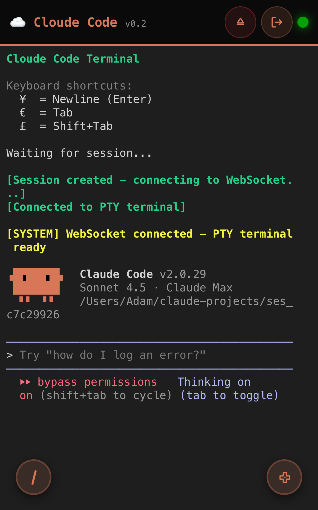
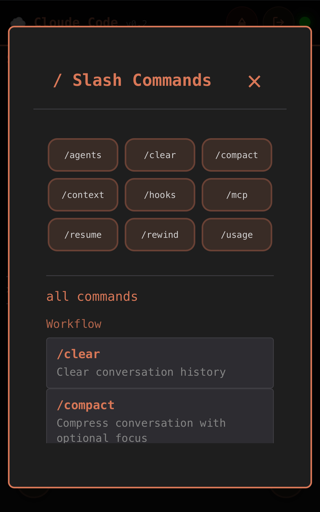
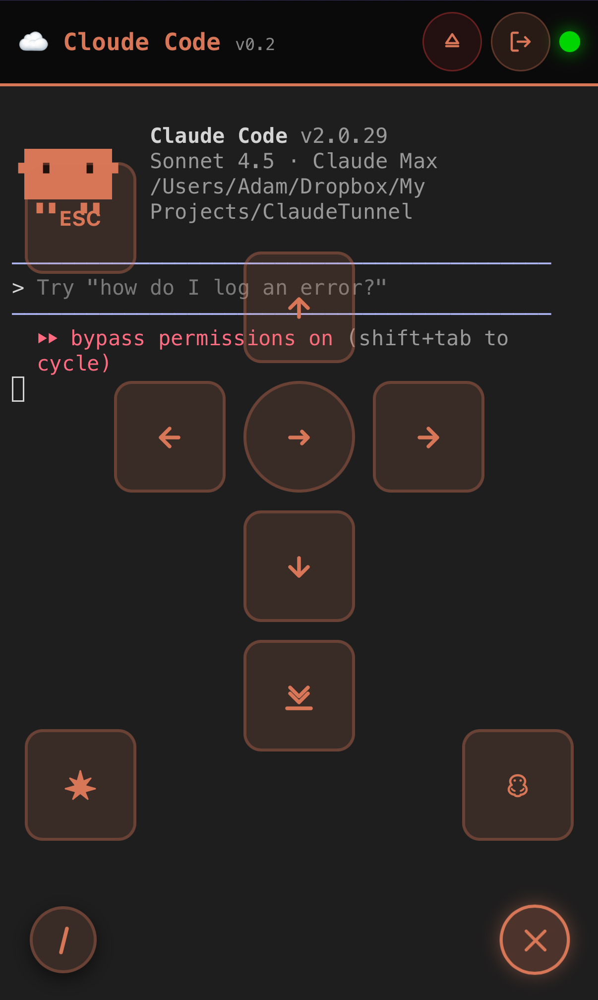
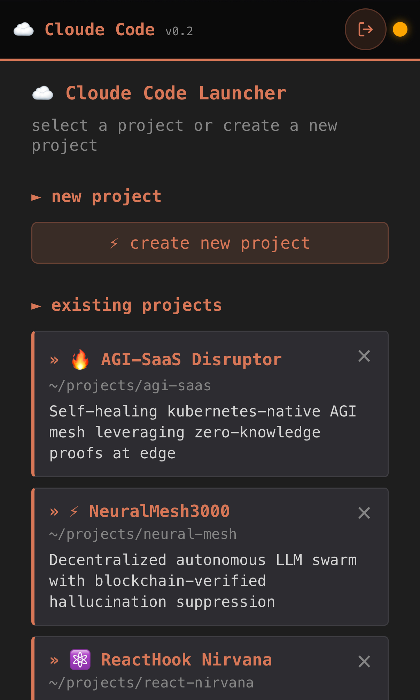
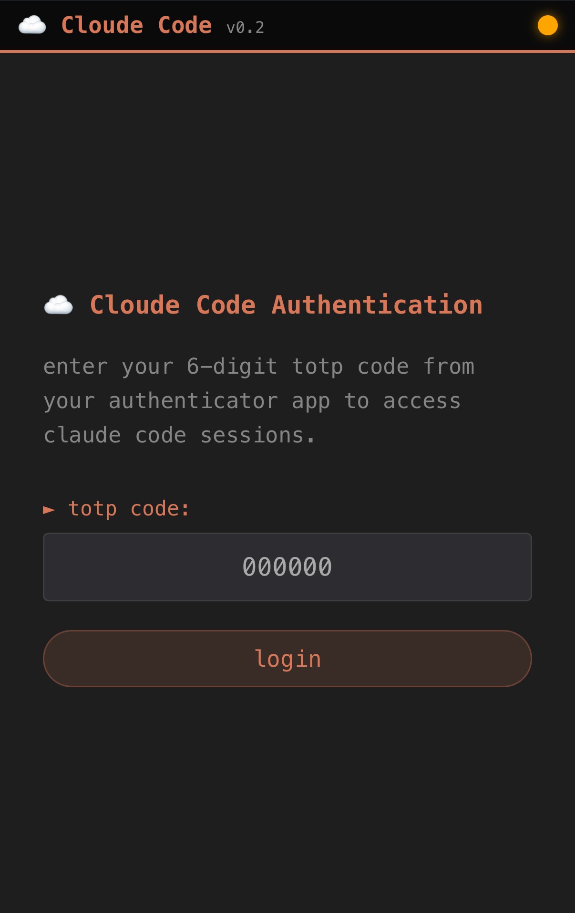

# ☁️ Cloude Code

Remote control and monitoring for Claude Code CLI - code from anywhere.

Control Claude Code sessions from any device on your network. Built for mobile-first development workflows with auto-tunneling, persistent sessions, and real-time terminal streaming.

[](https://www.youtube.com/shorts/tGcRtH_RLiE)

> **Quick Demo:** Watch Cloude Code in action - mobile control, auto-tunneling, and real-time terminal streaming.

## What It Does

Runs Claude Code in a persistent pseudo-terminal on your Mac and exposes a web-based control interface. Access your coding session from your phone, tablet, or another computer. When Claude spins up a dev server, it automatically creates a public Cloudflare tunnel and broadcasts the URL to all connected clients.

Perfect for developers who want to code on the couch, monitor long-running tasks from their phone, or quickly share dev environments without manual tunnel setup.



> **Live Terminal:** Full xterm.js terminal with WebSocket streaming, mobile D-pad controls, and slash command shortcuts.

## Key Features

- **PTY-Based Persistent Sessions** - Claude Code runs in an isolated pseudo-terminal that survives server restarts
- **Real-Time WebSocket Terminal** - Full bidirectional terminal I/O with xterm.js rendering and Unicode support
- **Intelligent Auto-Tunneling** - Pattern detection automatically creates Cloudflare tunnels when dev servers start
- **Hybrid Tunnel Strategy** - Choose between quick tunnels (instant, random URLs) or named tunnels (persistent custom domains)
- **Web Launchpad Interface** - Terminal-aesthetic UI for project management and session control
- **TOTP Authentication** - Secure access with Google Authenticator/Authy 2FA and JWT tokens
- **Project Management** - Quick-launch predefined projects with template file copying
- **Mobile-Optimized** - D-pad controls, special keyboard shortcuts (¥=Enter, €=Tab), and responsive design
- **Pattern Detection Engine** - Monitors terminal output for `localhost:PORT` and "Server ready" signals
- **Session Recovery** - Automatically validates and reconnects to existing sessions on startup

## Features in Detail

### Slash Commands Modal

Quick-access modal for all Claude Code slash commands with one-click insertion.



**How to use:**
- Click the floating slash (/) button in the bottom-right of the terminal
- Select from common commands (top section) or browse all 49+ commands (bottom section)
- Commands are inserted into terminal without executing - customize before pressing Enter
- ESC key or click outside to close

**Command categories:**
- **Workflow**: /clear, /compact, /rewind, /resume
- **Configuration**: /config, /model, /permissions, /settings
- **Account**: /login, /logout, /status
- **Development**: /sandbox, /review, /cost, /usage, /help
- **Project Setup**: /init, /add-dir, /agents
- **Utilities**: /doctor, /mcp, /memory, /vim, /bug, /context, /hooks

**Customization:**
Edit `config.json` to customize "common commands" shown at the top:
```json
{
  "common_slash_commands": [
    "/agents", "/clear", "/compact", "/context",
    "/hooks", "/mcp", "/resume", "/rewind", "/usage"
  ]
}
```

### Mobile Features

#### D-Pad Controls

Virtual D-pad overlay for mobile terminal navigation (auto-appears on touch devices).



**Button mappings:**
- **Arrow Keys**: UP, DOWN, LEFT, RIGHT navigation
- **Center Button**: ENTER/Return
- **ESC**: Escape key
- **TAB**: Tab key (🐛 icon)
- **⇧TAB**: Shift+Tab for reverse navigation (✨ icon)
- **⬇SCROLL**: Force scroll to bottom and re-enable auto-scroll

**Usage:**
- Tap floating D-pad button to open/close
- Touch-optimized with visual feedback
- Desktop-compatible for testing

#### Special Key Bindings

Mobile keyboards often lack terminal control keys. Use these shortcuts:

| Symbol | Function | Why |
|--------|----------|-----|
| `¥` (Yen) | Enter/Newline | iOS international keyboard |
| `€` (Euro) | Tab | Easy access on mobile |
| `£` (Pound) | Shift+Tab | Reverse tab navigation |

These appear in the terminal startup message as a reminder.

#### Smart Auto-Scroll

Intelligent scrolling that follows terminal output but doesn't fight you:
- **Auto-scrolls** when at bottom of terminal
- **Auto-disables** when you scroll up to read history
- **Re-enables** when you scroll back to bottom
- **Force enable** with D-pad scroll button

Prevents the annoying "fighting with auto-scroll" experience when reading logs.

### Project Management



> **Launchpad Interface:** Project management with quick-launch, descriptions, and emoji icons in a terminal-aesthetic UI.

#### Template File Copying

New projects automatically copy from a template directory (optional).

**Configuration:**
```json
{
  "template_path": "~/my-templates"
}
```

**Behavior:**
- Only copies for **new projects** (not existing ones)
- Triggered by `copy_templates: true` flag when creating session
- Smart exclusions: `.git`, `node_modules`, `venv`, `__pycache__`, `.env`, `.DS_Store`, etc.

#### Project Features

- **Auto-reordering**: Projects automatically sort by most recently used
- **Descriptions**: Add descriptions when creating projects
- **Quick Delete**: × button on each project with confirmation
- **No-delete guarantee**: Deleting from launcher never deletes actual files

### Pattern Detection Engine

Monitors terminal output for intelligent automation triggers:

| Pattern | Detects | Action |
|---------|---------|--------|
| **localhost_server** | `localhost:PORT`, `127.0.0.1:PORT`, `0.0.0.0:PORT`, `[::]:PORT` | Create tunnel |
| **server_ready** | "server running", "development server started" | Create tunnel |
| **listening_on_port** | "listening on port 3000", "running on :8080" | Create tunnel |
| **error** | ERROR, Error, FAIL, Failed | Log detection |
| **warning** | WARNING, WARN | Log detection |
| **file_created** | "Created file:", "Saved file:" | Log detection |
| **build_complete** | "build successful", "compilation finished" | Log detection |
| **test_result** | "tests passed", "specs failed" | Log detection |

### Smart Reliability Features

#### Auto-Reconnect
- WebSocket automatically reconnects if connection drops
- Exponential backoff: 1s → 2s → 4s → 8s → 16s
- Max 5 attempts with status shown in terminal

#### WebSocket Keepalive
- Ping sent every 30 seconds
- Prevents timeout on mobile networks
- Automatic pong response

#### Session Conflict Resolution
- Detects if session already running when creating new one
- Prompts: Connect to existing OR destroy and create new
- Prevents orphaned sessions

### Advanced Configuration

Additional `config.json` options:

```json
{
  "jwt_expiry_minutes": 30,           // JWT token lifetime (default: 30)
  "template_path": "~/my-templates",  // Template directory for new projects
  "common_slash_commands": [          // Quick-access slash commands
    "/agents", "/clear", "/usage"
  ]
}
```

## Use Cases

- **Mobile Development**: Start Claude Code on your Mac, control it from your phone while away from your desk
- **Remote Pair Programming**: Share tunnel URLs so others can see your Claude Code session in real-time
- **Auto-Share Dev Servers**: Claude detects when you spin up a server and automatically creates a public URL
- **Multi-Device Workflows**: Start coding on your desktop, continue on the couch with your tablet
- **Live Demos**: Share live coding sessions and dev servers via public tunnel links

## Prerequisites

- **Python 3.11+**
- **Claude CLI** - Installed and configured (`claude` command in PATH)
- **cloudflared** - Cloudflare tunnel CLI ([install](https://developers.cloudflare.com/cloudflare-one/connections/connect-apps/install-and-setup/installation/))
- **macOS/Linux** - Tested on macOS, should work on Linux

Install system dependencies:
```bash
# macOS
brew install cloudflared

# Ensure Claude CLI is installed
which claude  # Should return a path
```

## Quick Start

### 1. Install Dependencies

```bash
# Clone and navigate to project
cd "Cloude Code"

# Create virtual environment and install Python packages
python3 -m venv venv
source venv/bin/activate
pip install -r requirements.txt
```

### 2. Configure Environment

**IMPORTANT: Do this BEFORE running setup or auth scripts.**

```bash
# Copy environment template
cp .env.example .env

# Edit .env and configure required settings:
nano .env  # or use your preferred editor
```

**Required settings:**
- `DEFAULT_WORKING_DIR` - Where new projects are created (e.g., `~/cloude-projects`)
- `LOG_DIRECTORY` - Where logs are stored (e.g., `/tmp/cloude-code-logs`)

**Optional settings:**
- `CLOUDFLARE_API_TOKEN` - For named tunnels (can skip for now)
- `CLOUDFLARE_ZONE_ID` - For named tunnels
- `CLOUDFLARE_DOMAIN` - Your custom domain (e.g., `cloude.yourdomain.com`)
- `CLOUDFLARE_TUNNEL_NAME` - Tunnel name (e.g., `cloude-controller`)

### 3. Configure Authentication

```bash
# Generate TOTP secret and JWT key
python3 setup_auth.py
```

This will:
- Generate a TOTP secret for 2FA
- Create JWT secret for token auth
- Display a QR code for Google Authenticator/Authy
- Save secrets to `.env` (TOTP_SECRET, JWT_SECRET)
- Save configuration to `./config.json` (projects, template_path, etc.)
- Save QR image to `./totp-qr.png`

Scan the QR code with your authenticator app.



> **Secure Access:** TOTP 2FA login screen - scan QR with Google Authenticator or Authy.

### 4. Verify Setup

```bash
# Run setup script to check all dependencies
./setup.sh
```

This validates that `cloudflared`, `claude`, Python, and all configuration is properly set up.

### 5. Start the Server

```bash
# Start API server
./start.sh

# Or manually:
source venv/bin/activate
python3 -m src.main
```

Server runs on `http://0.0.0.0:8000`

### 6. Access Launchpad

Open `http://localhost:8000` in your browser (or `http://YOUR_IP:8000` from phone).

- Enter your TOTP code to authenticate
- Create a new project or select existing
- Terminal loads with Claude Code running

## Configuration

### Environment Variables (.env)

Key settings you might want to change:

```bash
# Server
HOST=0.0.0.0              # Bind to all interfaces for network access
PORT=8000                 # API server port

# Sessions
DEFAULT_WORKING_DIR=~/cloude-projects  # Where new projects are created
SESSION_TIMEOUT=3600                   # Session idle timeout (seconds)

# Authentication (generated by setup_auth.py - don't edit manually)
TOTP_SECRET=              # TOTP secret for 2FA
JWT_SECRET=               # JWT signing secret
AUTH_CONFIG_FILE=./config.json  # Path to config.json

# Tunnels
AUTO_CREATE_TUNNELS=true               # Auto-create tunnels when ports detected
USE_NAMED_TUNNELS=false                # Use named tunnels (requires Cloudflare config)

# Cloudflare (for named tunnels only)
CLOUDFLARE_API_TOKEN=your_token        # API token with DNS edit + Tunnel edit perms
CLOUDFLARE_ZONE_ID=your_zone_id        # Zone ID for your domain
CLOUDFLARE_DOMAIN=cloude.yourdomain.com  # Your custom domain
CLOUDFLARE_TUNNEL_NAME=cloude-controller # Tunnel name
CLOUDFLARE_TUNNEL_ID=                  # Optional: Skip tunnel lookup, uses auto-discovery if empty
```

### Cloudflare Tunnel Modes

#### Quick Tunnels (Default)
Uses `trycloudflare.com` - no account required.

**Pros:**
- Zero config
- Instant creation
- Free

**Cons:**
- Random URLs that change on restart
- Less stable
- Subject to rate limits

**Usage:** Works out of the box, no setup needed.

---

#### Named Tunnels (Recommended)
Uses your Cloudflare account with persistent custom domains.

**Pros:**
- Stable URLs like `3000.cloude.yourdomain.com`
- Single persistent tunnel, multiple ports
- CNAMEs auto-created and reused
- More reliable

**Cons:**
- Requires Cloudflare account (free)
- Initial setup needed

**Setup:**

1. **Authenticate cloudflared:**
   ```bash
   cloudflared login
   ```
   Opens browser for OAuth flow.

2. **Create Cloudflare API Token:**
   - Go to https://dash.cloudflare.com/profile/api-tokens
   - "Create Token" → "Edit zone DNS" template
   - Add permissions: `Zone.DNS:Edit` and `Account.Cloudflare Tunnel:Edit`
   - Copy token

3. **Get Zone ID:**
   - Go to your domain's overview in Cloudflare dashboard
   - Scroll to "API" section → Copy "Zone ID"

4. **Update `.env`:**
   ```bash
   USE_NAMED_TUNNELS=true
   CLOUDFLARE_API_TOKEN=your_token_here
   CLOUDFLARE_ZONE_ID=your_zone_id
   CLOUDFLARE_DOMAIN=cloude.yourdomain.com
   CLOUDFLARE_TUNNEL_NAME=cloude-code
   ```

5. **Restart server** - Named tunnel will auto-create and persist.

When dev servers start, CNAMEs like `3000.cloude.yourdomain.com` are automatically created and reused across restarts.

## Architecture

```
┌─────────────────────────────────────┐
│   Browser/Mobile Client             │
│   ├── Auth (TOTP)                   │
│   ├── Launchpad (Project Manager)   │
│   └── xterm.js Terminal             │
└──────────────┬──────────────────────┘
               │ WebSocket + REST API
┌──────────────┴──────────────────────┐
│   FastAPI Server (Python)           │
│   ├── Session Manager (PTY)         │
│   ├── Log Monitor (Pattern Detect)  │
│   ├── Hybrid Tunnel Manager         │
│   ├── Auto-Tunnel Orchestrator      │
│   └── Cloudflare API Integration    │
└──────────────┬──────────────────────┘
               │
         ┌─────┴─────┐
         │           │
    ┌────┴───┐  ┌────┴─────────┐
    │ PTY    │  │ Cloudflared  │
    │ Process│  │ Tunnels      │
    │ (Claude│  │ (Public URLs)│
    │  Code) │  │              │
    └────────┘  └──────────────┘
```

**Flow:**
1. User authenticates with TOTP code
2. Launchpad creates/connects to PTY session running Claude Code
3. Terminal streams bidirectional I/O via WebSocket
4. Log monitor watches terminal output for port patterns
5. Auto-tunnel creates Cloudflare tunnel when `localhost:PORT` detected
6. Tunnel URL broadcast to all connected clients
7. Session persists across server restarts

## Project Structure

```
CloudeCode/
├── src/
│   ├── main.py                      # FastAPI app entry
│   ├── config.py                    # Environment config
│   ├── models.py                    # Pydantic models
│   ├── core/                        # Business logic
│   │   ├── session_manager.py       # PTY session management
│   │   ├── log_monitor.py           # Pattern detection
│   │   ├── tunnel_manager.py        # Quick tunnels
│   │   ├── named_tunnel_manager.py  # Named tunnels
│   │   ├── hybrid_tunnel_manager.py # Tunnel strategy
│   │   ├── auto_tunnel.py           # Auto-tunnel orchestration
│   │   └── cloudflare_api.py        # Cloudflare DNS API
│   ├── api/                         # API layer
│   │   ├── routes.py                # REST endpoints
│   │   ├── websocket.py             # WebSocket handlers
│   │   └── auth.py                  # TOTP/JWT auth
│   └── utils/                       # Utilities
│       ├── pty_session.py           # PTY process wrapper
│       ├── patterns.py              # Regex pattern matcher
│       └── template_manager.py      # Project templates
├── client/                          # Frontend
│   ├── index.html                   # Single-page app
│   ├── css/styles.css               # Terminal aesthetic
│   └── js/
│       ├── api.js                   # API client
│       ├── auth.js                  # Auth module
│       ├── launchpad.js             # Project launcher
│       ├── terminal.js              # xterm.js integration
│       ├── dpad.js                  # Mobile controls
│       └── slash-commands.js        # Slash commands modal
├── .env.example                     # Environment template
├── .env                             # Secrets (TOTP, JWT) - gitignored
├── config.json                      # Configuration (projects, templates, etc.)
├── config.example.json              # Config template
├── requirements.txt                 # Python deps
├── setup.sh                         # Dependency checker
├── setup_auth.py                    # TOTP setup script
├── start.sh                         # Start server script
├── stop.sh                          # Stop server script
├── reset.sh                         # Restart server script
└── README.md                        # This file
```

## API Reference

### Authentication

**Get TOTP Config:**
```bash
GET /api/v1/auth/totp/config
```

**Verify TOTP:**
```bash
POST /api/v1/auth/totp/verify
{"token": "123456"}
```
Returns JWT token.

### Sessions

**Create Session:**
```bash
POST /api/v1/sessions
{
  "working_directory": "~/my-project",
  "auto_start_claude": true
}
```

**Get Session Info:**
```bash
GET /api/v1/sessions
```

**Destroy Session:**
```bash
DELETE /api/v1/sessions
```

### Projects

**List Projects:**
```bash
GET /api/v1/projects
```

**Create Project:**
```bash
POST /api/v1/projects
{
  "name": "my-app",
  "path": "~/projects/my-app",
  "description": "My new project"
}
```

**Delete Project:**
```bash
DELETE /api/v1/projects/{name}
```

### Tunnels

**List Active Tunnels:**
```bash
GET /api/v1/tunnels
```

**Create Manual Tunnel:**
```bash
POST /api/v1/tunnels
{"port": 3000}
```

**Destroy Tunnel:**
```bash
DELETE /api/v1/tunnels/{port}
```

### WebSocket

**Connect to Terminal:**
```
ws://localhost:8000/ws/terminal?token=YOUR_JWT_TOKEN
```

**Receive messages:**
- Terminal output: `{"type": "output", "data": "base64_encoded_data"}`
- Tunnel created: `{"type": "tunnel_created", "tunnel": {...}}`
- Keepalive: `{"type": "ping"}`

**Send messages:**
- Terminal input: `{"type": "input", "data": "command text"}`
- Resize: `{"type": "resize", "cols": 80, "rows": 24}`
- Pong: `{"type": "pong"}`

## Troubleshooting

### Authentication Fails
- **Symptom**: TOTP code rejected
- **Fix**: Run `python3 setup_auth.py` again and re-scan QR code. Check system clock is synced (TOTP is time-based).

### Tunnels Not Creating
- **Symptom**: Dev servers start but no tunnel URL appears
- **Check**:
  - `which cloudflared` returns a path
  - `AUTO_CREATE_TUNNELS=true` in `.env`
  - Look for "Tunnel created" in terminal output
- **Test manually**: `cloudflared tunnel --url http://localhost:3000`

### Can't Connect from Phone
- **Symptom**: `http://YOUR_IP:8000` times out
- **Check**:
  - Phone on same WiFi network
  - Mac firewall allows port 8000: System Preferences → Security → Firewall
  - Find Mac IP: `ifconfig | grep inet` (look for 192.168.x.x)
  - Try `http://localhost:8000/health` on Mac first

### Claude Not Starting
- **Symptom**: Session created but Claude doesn't launch
- **Check**:
  - `which claude` or `ls ~/.claude/local/claude` works
  - Claude CLI is authenticated: `claude --help`
  - Check session logs via WebSocket or API
- **Manual test**: Run `claude --dangerously-skip-permissions` in terminal

### Session Lost After Reboot
- **Symptom**: Can't reconnect to session after Mac restart
- **Cause**: PTY processes don't survive reboots
- **Fix**: Create new session (old session auto-cleaned on server start)

### Named Tunnel CNAMEs Not Creating
- **Symptom**: Tunnel works but DNS records not created
- **Check**:
  - `CLOUDFLARE_API_TOKEN` has `Zone.DNS:Edit` permission
  - `CLOUDFLARE_ZONE_ID` matches your domain's Zone ID
  - Check API logs in terminal output
- **Manual test**: Use Cloudflare dashboard to create a test DNS record

## Development

### Running Tests

```bash
# Activate virtual environment
source venv/bin/activate

# Run all tests
pytest tests/ -v

# Run specific test file
pytest tests/test_session_manager.py -v
```

### Contributing

Pull requests welcome. For major changes, open an issue first.

**Development setup:**
1. Fork the repo
2. Create feature branch (`git checkout -b feature/amazing-feature`)
3. Make changes and test
4. Commit (`git commit -m 'Add amazing feature'`)
5. Push (`git push origin feature/amazing-feature`)
6. Open Pull Request

## License

MIT

---

Built for developers who want to code from anywhere. No more being chained to your desk.
